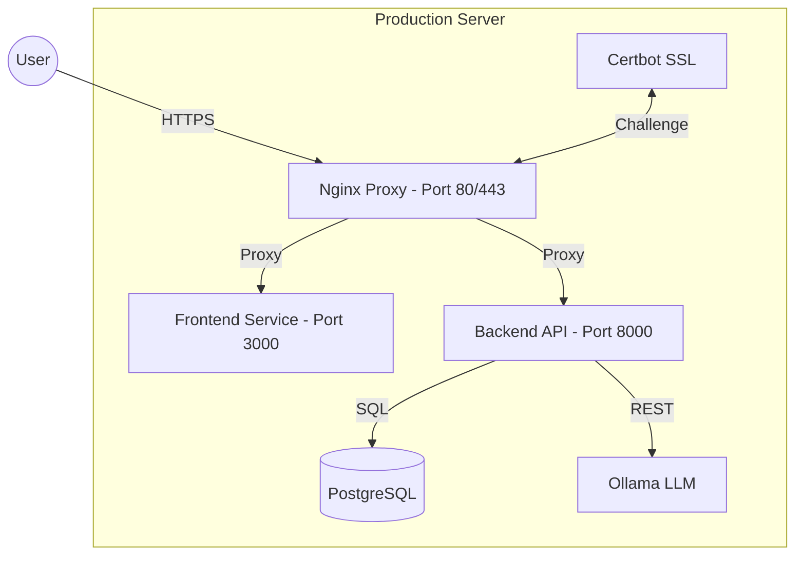

# Job Wizard - Production Deployment Guide

This guide explains how to deploy Job Wizard to a production environment.

## 🎯 Production Architecture

In production, Nginx acts as the primary reverse proxy and SSL terminator. It is the **only service exposed to the internet**.



**Security Benefits:**
- ✅ **Encapsulation**: Internal services (DB, LLM) are isolated from the internet.
- ✅ **SSL Termination**: Nginx manages HTTPS certificates centrally.
- ✅ **Simplified Access**: Users connect via standard ports (80/443).

---

## 📋 Prerequisites

1. **Linux Server** (Ubuntu 22.04+ recommended)
2. **Docker & Docker Compose** installed
3. **Domain Name** (e.g., `job-vite.com`) pointing to your server IP
4. **Hardware**: At least 4GB RAM (8GB recommended for local Ollama)

---

## 🚀 Initial Deployment

### 1. Clone the project
```bash
git clone <your-repo-url> /root/job_wizard
cd /root/job_wizard
```

### 2. Configure Environment Variables
Create and edit `.env.production`:
```bash
cp .env.production.example .env.production
nano .env.production
```

#### Critical Backend Variables
| Variable | Description | Recommended Value |
| :--- | :--- | :--- |
| `POSTGRES_PASSWORD` | Strong password for DB | `cat /dev/urandom | tr -dc 'a-zA-Z0-9' | fold -w 32 | head -n 1` |
| `OPENROUTER_API_KEY` | API key for cloud LLM | Optional but recommended for performance |
| `LOGFIRE_TOKEN` | Token for observability | [logfire.pydantic.dev](https://logfire.pydantic.dev) |

#### Critical Frontend Variables
| Variable | Description | Example |
| :--- | :--- | :--- |
| `ORIGIN` | Public URL of your app | `https://yourdomain.com` |
| `VITE_API_URL` | Public API endpoint | `https://yourdomain.com/api` |
| `CORS_ORIGINS` | Allowed origins | `https://yourdomain.com` |

### 3. Deploy Stack
```bash
./scripts/deploy_production.sh
```
*Note: This script will ask to initialize the database and seed an initial user.*

---

## 🔒 SSL & HTTPS Setup (Let's Encrypt)

The production configuration includes a `certbot` service for automated SSL management.

### 1. Generate Certificates
Run this once to generate early certificates:
```bash
docker compose -f docker-compose.prod.yml run --rm certbot certonly --webroot -w /var/www/certbot -d yourdomain.com -d www.yourdomain.com --email your@email.com --agree-tos --no-eff-email
```

### 2. Restart Nginx
Once certificates are in `certbot/conf`, restart Nginx to pick them up:
```bash
docker compose -f docker-compose.prod.yml restart nginx
```

### 3. Automated Renewal
Add a crontab entry to renew certificates weekly:
```bash
0 0 * * 0 docker compose -f /root/job_wizard/docker-compose.prod.yml run --rm certbot renew && docker compose -f /root/job_wizard/docker-compose.prod.yml restart nginx
```

---

## 🔄 Routine Updates

To deploy the latest code from GitHub:

```bash
# Recommended: Automatic update with backup and rollback
./scripts/update-production.sh

# Manual:
git pull
docker compose -f docker-compose.prod.yml up -d --build
```

---

## 💾 Maintenance & Backups

### Database Backups
A backup script is provided that creates timestamped SQL dumps in `./backups/`.
```bash
./scripts/backup-db.sh
```
*Tip: Schedule this via Cron for daily backups.*

### Log Management
```bash
# Follow all logs
docker compose -f docker-compose.prod.yml logs -f

# Follow specific service (e.g., backend)
docker compose -f docker-compose.prod.yml logs -f backend
```

---

## 🐛 Troubleshooting

| Issue | Solution |
| :--- | :--- |
| **502 Bad Gateway** | Check if the `backend` container is healthy: `docker ps`. If it crashed, check logs: `docker logs jobwizard-backend-prod`. |
| **Connection Refused** | Ensure ports 80/443 are open in your server firewall (`ufw allow 80/tcp`, `ufw allow 443/tcp`). |
| **Ollama Model Missing** | Ollama might still be downloading the model. Check `docker logs jobwizard-ollama-prod`. |
| **CSS/JS 404s** | Ensure `ORIGIN` and `VITE_API_URL` exactly match the domain you are using. |

---

## 📊 Monitoring
- **Internal Health**: `curl http://localhost/health`
- **Resource Usage**: `docker stats`
- **External Traces**: Check your Logfire dashboard at [logfire.pydantic.dev](https://logfire.pydantic.dev).
