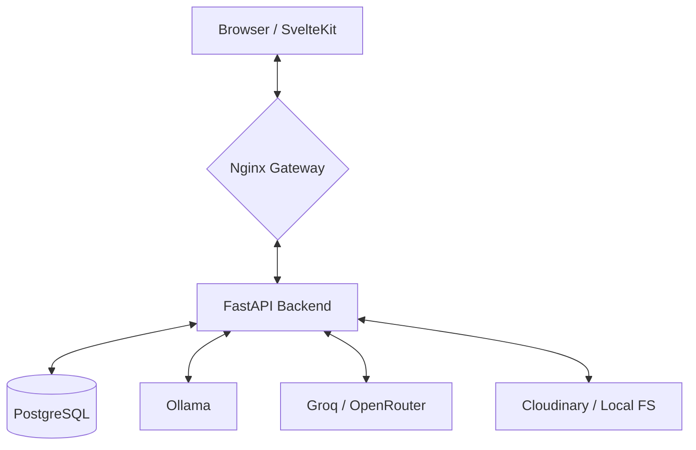

# Vite a Job! 🚀

A premium web application that generates personalized, high-fidelity cover letters and revitalizes old CVs into professional PDFs using advanced AI. Simply paste a job URL or description to get a custom cover letter, or upload your old CV to automatically parse and render it into modern, classic, or timeline templates.

## ✨ Features

- 📄 **CV Refresh**: Transform your old PDF CV into a sleek, professional document. Our AI (LlamaParse + Groq) extracts your experience, education, and skills.
- 🎨 **Premium Templates**: Choose from **Modern**, **Classic**, or the new **Timeline** templates, all designed for maximum impact.
- 🌍 **Global Support**: Full localization for cover letters and CVs in:
  - 🇬🇧 **English** (Standard Professional)
  - 🇩🇪 **German** (DIN 5008 compliant)
  - 🇫🇷 **French** (Lettre de Motivation)
  - 🇪🇸 **Spanish** (Carta de Presentación)
- 👁️ **High-Fidelity Preview**: What you see is what you get. Our "Atomic Block" reconciliation ensures 1:1 parity between the web preview and the final PDF output.
- 🔗 **Smart Job Parsing**: Instant extraction of job details from LinkedIn, Indeed, StepStone, We Work Remotely, and Arbeitnow.
- 🚀 **Hybrid LLM Engine**: "Race Mode" orchestration between local (Ollama) and remote (Groq/OpenRouter) models for sub-second generation.
- 🖼️ **Profile Picture Suite**: Professional photo cropping and high-quality scaling via **Cloudinary** integration.
- 📂 **Smart Filenames**: Automatically generated, localized filenames (e.g., `John_Doe_2024_Google_CoverLetter.pdf`) for better organization.
- 🐳 **Docker Ready**: Fully containerized multi-service architecture for easy deployment.

## 🏗️ Architecture



## 🛠️ Tech Stack

- **Backend**: Python 3.11 + **FastAPI** + **uv** (Dependency Management)
- **Frontend**: **SvelteKit** + **TailwindCSS** + **TypeScript**
- **LLM Orchestration**: Local (Ollama) & Remote (Groq, OpenRouter)
- **Data & Parsing**: PostgreSQL 16, LlamaParse, BeautifulSoup4
- **Infrastructure**: Docker & Docker Compose, Nginx, Certbot
- **Storage & Assets**: Cloudinary (Profiles), Local Backups

## 🚀 Quick Start

```bash
# Clone the repository
git clone https://github.com/remitoudic/job_wizard.git
cd job_wizard

# Start all services (auto-configures .env)
./scripts/start_locally.sh

# Initial setup: pull the local LLM model
docker exec jobwizard-ollama ollama pull llama3.2:1b
```

**Access the application at**: [http://localhost:5173](http://localhost:5173)

> [!NOTE]
> For a deep dive into environment variables, testing, and production deployment, check out [DEVELOPMENT.md](DEVELOPMENT.md).

## 💡 Usage

1. **Input**: Paste a job URL or manual text.
2. **Context**: Upload your existing CV for background extraction.
3. **Customize**: Choose your language and template.
4. **Generate**: Watch the AI race to create your content.
5. **Review**: Use the high-fidelity preview to make final tweaks.
6. **Download**: Get your localized, professionally formatted PDF.

## 🔧 Troubleshooting

- **Model Issues**: Ensure Ollama is running and the model is pulled: `ollama pull llama3.2:1b`.
- **Parsing Errors**: Verify your `LLAMA_CLOUD_API_KEY` in `.env`.
- **Image Uploads**: Check `CLOUDINARY_URL` configuration.
- **Preview Parity**: If the preview looks different, ensure you are using a modern Chromium-based browser.

## ⚖️ License

MIT - See [LICENSE](LICENSE) for details.


