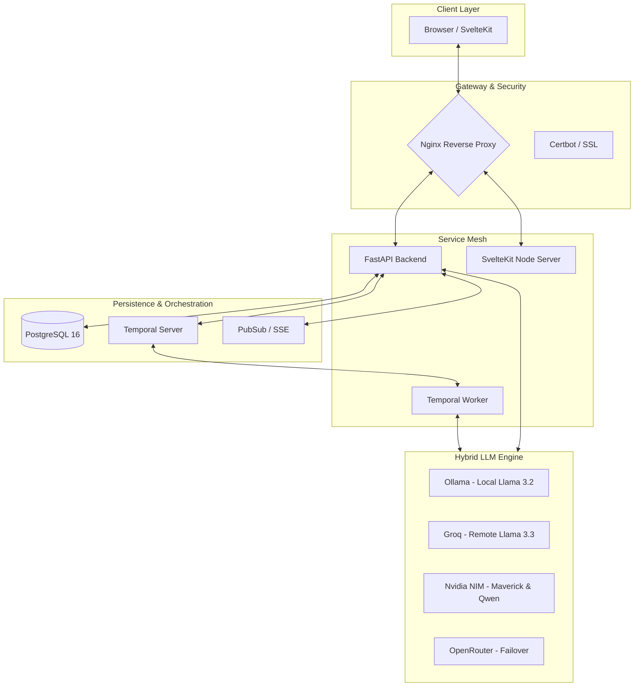
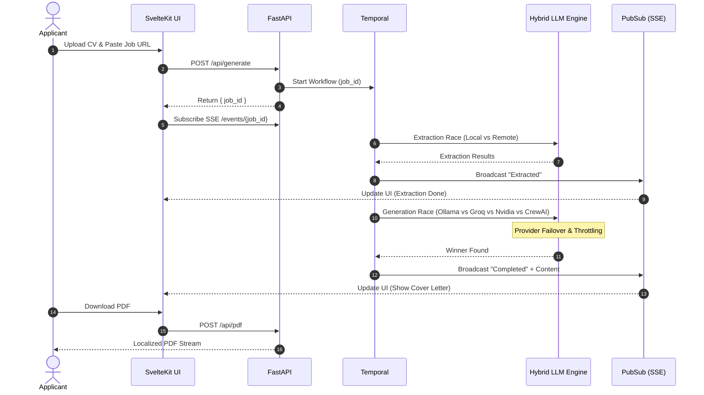

# Vite a Job! 🚀

**The ultimate AI-powered career assistt.**
Transform your job application process from hours of manual writing to seconds of AI-orchestrated precision. Job Wizard generates high-fidelity, personalized cover letters and revitalizes old CVs into professional, modern PDFs

[](https://opensource.org/licenses/MIT)
[](https://www.python.org/downloads/release/python-3110/)
[](https://fastapi.tiangolo.com/)
[](https://temporal.io/)

---

## ✨ Features

- 📄 **CV Revitalization**: Transform legacy PDF CVs into sleek, professional documents. Powered by **LlamaParse** and **Groq** for high-accuracy extraction.
- 👥 **Multi-Agent Cover Letter Agency**: Powered by **CrewAI**, simulating a professional writing team where three specialized agents (Profile Analyst, Copywriter, and Strict Editor) collaborate sequentially to construct highly tailored, human-sounding cover letters without generic templates or AI clichés.
- 🎨 **Premium Templates**: Choose from **Modern**, **Classic**, or **Timeline** templates, engineered for ATS compatibility and visual impact.
- 🌍 **Deep Localization**: Standardized professional formatting for:
  - 🇬🇧 **English** (Standard) | 🇩🇪 **German** (DIN 5008) | 🇫🇷 **French** (Lettre de Motivation) | 🇪🇸 **Spanish** (Standard)
- 🔗 **Intelligent Scraping**: Instant extraction from LinkedIn, We Work Remotely, and Arbeitnow...
- 🚀 **Hybrid LLM Race Mode**: Sub-second generation using a concurrent race between local (**Ollama**) and remote (**Groq/Nvidia/OpenRouter**) providers.
- ☁️ **Cloud API Keys**: Developers can generate and manage custom API keys in the dashboard, enabling secure, programmatic access to the generation engine from external applications or MCP clients.
- 🔌 **MCP Server**: Seamlessly integrate with external AI assistants (like Gemini or Cursor) via the built-in Model Context Protocol server. Allow your AI to autonomously manage your applications, such as automatically updating statuses from email updates.

---

## 🏗️ Architecture



---

## 🧠 Technical Deep Dive

### 1. Hybrid LLM Race Mode
To ensure maximum speed and reliability, Job Wizard employs a **Race Mode** for all LLM calls:
- **Concurrency**: A local Ollama instance (llama3.2) races against high-speed cloud providers (**Groq** and **Nvidia NIM**).
- **Failover**: If a provider returns a 429 (Rate Limit) or 5xx (Server Error), the system automatically fails over to a secondary provider (e.g., Groq -> OpenRouter) mid-request.
- **Throttling**: Intelligent semaphore management ensures local resources are never overwhelmed.

### 2. Fault-Tolerant Orchestration (Temporal.io)
All generation workflows are managed by **Temporal**, providing:
- **Durability**: Workflows resume exactly where they left off if a container restarts.
- **Observability**: Real-time tracking of generation phases (Extraction -> Generation -> Rendering).
- **Retry Polices**: Exponential backoff for flaky external APIs.

### 3. Production-Ready Infrastructure
- **Nginx Dynamic Resolution**: Uses Docker's embedded resolver to prevent `502 Bad Gateway` errors during container rolling updates.
- **Real-Time Streaming**: Unbuffered Server-Sent Events (SSE) combined with intelligent UI state reconciliation guarantees you never miss a generation update, even if your browser reconnects.
- **Logfire Observability**: Deep tracing of every LLM span and database transaction.
- **Atomic Rendering**: A custom ReportLab engine that guarantees the PDF exactly matches the "Atomic Blocks" seen in the browser preview.

### 4. Multi-Agent Orchestration (CrewAI)
To elevate the quality of generated cover letters, Job Wizard integrates a **CrewAI** sequential agent pipeline. Instead of relying on a single prompt (which often yields generic or robotic text), the system simulates a professional writing agency with three specialized agents working in sequence:
- **Profile Analyst** (low temperature `0.1` for maximum precision): Extracts the candidate's core background, matches it to the job description, and defines the top 3 alignment points and an opening hook.
- **Copywriter** (higher temperature `0.7` for persuasion): Converts the analyst's brief into a cohesive, engaging narrative focused on how the candidate's achievements solve the employer's problems.
- **Strict Copy Editor** (low temperature `0.3` for structure and style): Tightens the prose, enforces word counts (< 300 words), removes sycophantic language, and strips out standard AI clichés (e.g., *“delve”*, *“testament to”*, *“in today's fast-paced world”*).

This sequential flow is dynamic and uses the central `llm_provider_service` to allow agents to seamlessly failover across Groq, Nvidia NIM, OpenRouter, or Ollama depending on API health.

---

## 🚀 Life of a Generation



---

## 🛠️ Tech Stack

- **Backend**: Python 3.11, FastAPI, Pydantic AI
- **Frontend**: SvelteKit, TailwindCSS, TypeScript
- **Orchestration**: Temporal.io
- **Database**: PostgreSQL 16
- **Real-time**: SSE (Server-Sent Events) via Redis/PubSub
- **Infrastructure**: Docker Compose, Nginx, Certbot

---

## 📚 Documentation

Detailed guides for developers and operators:
- [Development Guide](docs/DEVELOPMENT.md) - Local setup, environment variables, and testing.
- [Deployment Guide](docs/DEPLOYMENT.md) - Production deployment with Docker & Nginx.
- [Temporal Workflows](docs/TEMPORAL_WORKFLOWS.md) - Deep dive into the orchestration logic.
- [CrewAI Agents Guide](docs/CREWAI_AGENTS.md) - Deep dive into the multi-agent cover letter generation pipeline.
- [Debugging Guide](docs/DEBUGGING.md) - Troubleshooting common issues.
- [Monorepo Guide](docs/MONOREPO_GUIDE.md) - Overview of the project structure.
- [MCP Server Design](docs/mcp-server-design.md) - Architecture and capabilities of the Model Context Protocol server.
- [MCP E2E Testing](docs/mcp-e2e-testing.md) - Guide for testing the MCP server using the Inspector and real LLM agents.

---

## 🏁 Quick Start

```bash
# 1. Clone the repository
git clone https://github.com/remitoudic/job_wizard.git
cd job_wizard

# 2. Start all services
./scripts/start_locally.sh

# 3. Pull the local LLM model
docker exec jobwizard-ollama ollama pull llama3.2:1b
```

**Access the application at**: [http://localhost:5173](http://localhost:5173)
**Monitor Workflows at**: [http://localhost:8080](http://localhost:8080) (Temporal UI)

---

## ⚖️ License
MIT - See [LICENSE](LICENSE) for details...
