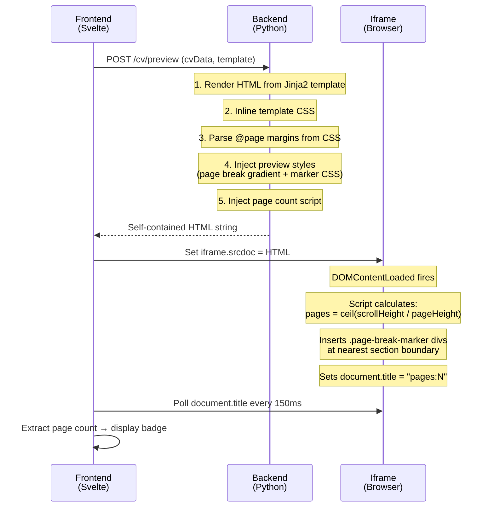

# CV Preview — Page Break Indicators

Visual page break indicators in the CV preview panel (`/cv-refresh`, step 3) so users can see exactly where their PDF will split across pages before downloading.

---

## Overview

The CV preview is rendered as an iframe displaying self-contained HTML produced by the backend. Previously, the preview showed a single continuous white sheet with no indication of page boundaries. Users had to download the PDF to discover their CV spanned multiple pages or that content was awkwardly split.

Now the preview shows:

- **Dashed separator lines** at each page boundary with "Page 2", "Page 3" labels
- **A gradient band** marking the gap between pages (mimicking a physical page break)
- **A page count badge** in the preview header ("📄 2 pages")

---

## How It Works



---

## Architecture

### Backend — `cv_generator_service.py`

The `render_html()` method is the single modification point. It already injected preview-specific CSS to make the iframe look like an A4 document. The page break feature extends this with three additions:

#### 1. Dynamic `@page` Margin Parsing

A helper function `_parse_page_margins(css_content)` extracts the `@page { margin }` declaration from the template's CSS. It handles all CSS shorthand formats:

| CSS Shorthand | Parsed As |
|---|---|
| `margin: 1.5cm` | top=1.5, right=1.5, bottom=1.5, left=1.5 |
| `margin: 1.25cm 1.5cm` | top=1.25, right=1.5, bottom=1.25, left=1.5 |
| `margin: 1cm 1.5cm 2cm` | top=1, right=1.5, bottom=2, left=1.5 |
| `margin: 1cm 1.5cm 2cm 1cm` | top=1, right=1.5, bottom=2, left=1 |

This ensures the page break position is accurate for every template.

#### 2. CSS Page Break Gradient

A `repeating-linear-gradient` on `.cv-container` draws a subtle `#f1f5f9` (slate-100) band every `297mm` — the full A4 page height. This creates a visual gap between "pages":

```css
background-image:
    repeating-linear-gradient(
        to bottom,
        transparent 0mm,
        transparent calc(297mm - 12px),
        #f1f5f9 calc(297mm - 12px),
        #f1f5f9 calc(297mm + 12px),
        transparent calc(297mm + 12px)
    );
background-size: 100% 297mm;
```

#### 3. Inline Page Count Script

A `<script>` tag injected into the HTML runs after DOMContentLoaded:

1. Measures `.cv-container.scrollHeight`
2. Calculates `pages = Math.ceil(scrollHeight / (297mm × 3.78px/mm))`
3. Walks all section-level elements (`.section`, `.experience-item`, `.education-item`, etc.)
4. For each page boundary, finds the nearest element and inserts a `.page-break-marker` div before it
5. Sets `document.title = "pages:N"` so the parent frame can read it

### Frontend — `+page.svelte`

Three additions:

| Addition | Purpose |
|---|---|
| `pageCount` state variable | Tracks estimated PDF pages (resets to 0 on each preview fetch) |
| `handleIframeLoad()` | Polls `iframe.contentDocument.title` every 150ms to extract `pages:N` |
| Page count badge | Displays next to "PREVIEW" label with document icon |

The badge uses **contextual coloring**:
- **Blue** (`#EFF6FF` / `#0369A1`) — 1–2 pages (normal)
- **Amber** (`amber-50` / `amber-700`) — 3+ pages (hint that CV might be long)

---

## Template-Specific Behavior

| Template | `@page` Margin | Content Height/Page | Page Break Elements |
|---|---|---|---|
| `modern_single` | `1.5cm` all | 267mm | `.experience-item`, `.education-item` |
| `modern` | `1.5cm` all | 267mm | `.experience-item`, `.education-item` |
| `classic` | `1.5cm` all | 267mm | `.entry-item` |
| `time_line` | `1.25cm 1.5cm` | 272mm | `.timeline-item` |

The `page-break-inside: avoid` rules in each template's CSS tell WeasyPrint to keep these elements on a single page. The preview script respects the same principle by placing the visual marker at the nearest **section boundary** rather than cutting through content.

---

## Accuracy

The page break indicator uses **CSS-based simulation** — it applies the same A4 dimensions and `@page` margins as WeasyPrint but relies on the browser's layout engine. This gives **~95–99% accuracy**.

Differences can occur when:
- WeasyPrint's `page-break-inside: avoid` pushes a block to the next page (browser doesn't enforce this for screen rendering)
- Font metrics differ slightly between the browser and WeasyPrint's font backend
- Float-based two-column layouts (e.g., `modern` template) resolve differently

For most CVs — especially single-column templates like `modern_single` and `classic` — the indicator is virtually pixel-perfect.

---

## Files Modified

| File | Change |
|---|---|
| `services/backend/app/services/cv_refresh/cv_generator_service.py` | Added `_parse_page_margins()`, updated `render_html()` preview styles with page break CSS + page count script |
| `services/frontend/src/routes/cv-refresh/+page.svelte` | Added `pageCount` state, `handleIframeLoad()` polling, page count badge, `allow-scripts` to iframe sandbox |

No database changes. No new dependencies. Fully backward-compatible.
