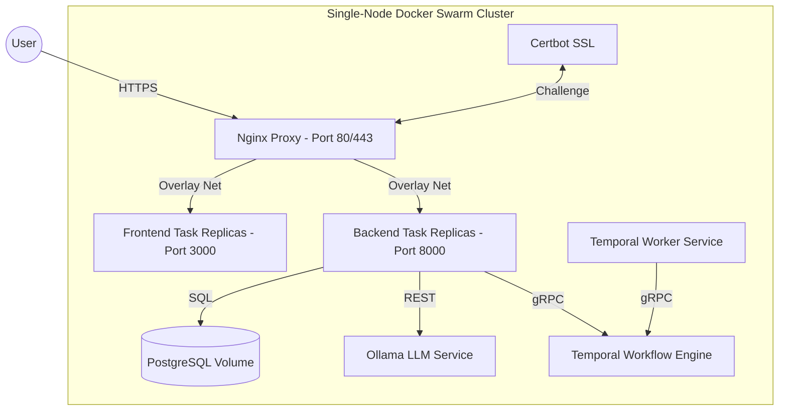

# Vite a Job! - Production Deployment Guide

This guide explains how to deploy Vite a Job! to a production environment using **Single-Node Docker Swarm**.

## 🎯 Production Architecture

In production, Nginx acts as the primary reverse proxy and SSL terminator inside a single-node **Docker Swarm** stack. It is the **only service exposed to the internet**.



**Key Advantages of Single-Node Docker Swarm:**

- ✅ **Zero-Downtime Rolling Updates**: Swarm launches updated container replicas (`order: start-first`) and checks container health (`/health`) before stopping older instances.
- ✅ **Self-Healing Infrastructure**: Automatically reschedules crashed or unhealthy container tasks.
- ✅ **Encapsulation & Security**: Internal microservices operate inside an attachable `overlay` network (`jobwizard-network`) isolated from direct public internet access.
- ✅ **Centralized SSL Termination**: Nginx manages HTTPS certificates with Let's Encrypt / Certbot.

---

## 📋 Prerequisites

1. **Linux Server** (Ubuntu 22.04+ recommended)
2. **Docker** (with Swarm support enabled)
3. **Domain Name** (e.g., `job-vite.com`) pointing to your server IP
4. **Hardware**: At least 4GB RAM (8GB+ recommended for local LLM workload)

---

## 🚀 Initial Deployment

### 1. Clone the project

```bash
git clone <your-repo-url> /root/job_wizard
cd /root/job_wizard
```

### 2. Configure Environment Variables

Create and edit `.env/.env.production`:

```bash
cp .env/.env.production.example .env/.env.production
nano .env/.env.production
```

#### Critical Backend Variables

| Variable             | Description             | Recommended Value                                    |
| :------------------- | :---------------------- | :--------------------------------------------------- |
| `POSTGRES_PASSWORD`  | Strong password for DB  | Generated strong secret                              |
| `OPENROUTER_API_KEY` | API key for cloud LLM   | Optional but recommended for performance             |
| `LOGFIRE_TOKEN`      | Token for observability | [logfire.pydantic.dev](https://logfire.pydantic.dev) |

#### Critical Frontend Variables

| Variable       | Description            | Example                      |
| :------------- | :--------------------- | :--------------------------- |
| `ORIGIN`       | Public URL of your app | `https://yourdomain.com`     |
| `VITE_API_URL` | Public API endpoint    | `https://yourdomain.com/api` |
| `CORS_ORIGINS` | Allowed origins        | `https://yourdomain.com`     |

### 3. Deploy Stack to Docker Swarm

Run the interactive production deployment script:

```bash
./scripts/deploy_production.sh
```

This script automatically:
1. 💾 Generates a pre-flight database backup in `services/backups/`.
2. 🐝 Verifies/initializes single-node Docker Swarm mode (`docker swarm init`).
3. 🏗️ Builds production service images (`backend`, `frontend`, `nginx`, `postgres`, `worker`).
4. 🚀 Deploys the stack via `docker stack deploy -c docker-compose.prod.yml jobwizard`.
5. 🌱 Seeds default initial administrative user credentials.

---

## 🔒 SSL & HTTPS Setup (Let's Encrypt)

The production configuration includes a `certbot` service for automated SSL management.

### 1. Generate Certificates

Run this once to generate certificates:

```bash
docker run --rm -v $(pwd)/services/certbot/conf:/etc/letsencrypt -v $(pwd)/services/certbot/www:/var/www/certbot certbot/certbot certonly --webroot -w /var/www/certbot -d yourdomain.com -d www.yourdomain.com --email your@email.com --agree-tos --no-eff-email
```

### 2. Reload Nginx

Once certificates are stored in `services/certbot/conf`, reload Nginx:

```bash
docker service update --force jobwizard_nginx
```

---

## 🔄 Routine Updates

### Automatic deploy (CI/CD)

Merges to `main` run the full CI suite (lint, backend unit tests, frontend tests). When CI passes, the **Deploy Production** job SSHs into the server and runs:

```bash
./scripts/update-production.sh -y
```

**Required GitHub Actions secrets** (Settings → Secrets and variables → Actions):

| Secret | Value |
| :----- | :---- |
| `DEPLOY_HOST` | Production server IP (e.g. `147.93.111.113`) |
| `DEPLOY_USER` | SSH user (e.g. `root`) |
| `DEPLOY_SSH_KEY` | Private key whose public key is in the server's `~/.ssh/authorized_keys` |

Also create a GitHub **Environment** named `production` (Settings → Environments) so the deploy job can run. Optional: add required reviewers for an approval gate before deploy.

### Manual updates

To deploy code updates safely with automated pre-flight backups, zero downtime, and automatic rollback on failure:

```bash
# Recommended: Automatic update with backup, health checks, and Swarm rolling updates
./scripts/update-production.sh

# Non-interactive (same path CI uses)
./scripts/update-production.sh -y

# Or full initial/redeploy script:
./scripts/deploy_production.sh
```

---

## 💾 Maintenance, Backups & Credentials

### Database Backups

A dedicated backup script creates timestamped SQL dumps in `./services/backups/`.

```bash
./scripts/backup-db.sh
```

### Admin Password Reset

To reset or update a user's password directly in the production container:

```bash
./scripts/reset-password.sh "remitoudic@gmail.com" "YOUR_NEW_PASSWORD"
```

### Swarm Stack Management & Logs

```bash
# View all Swarm services and replica counts
docker stack services jobwizard

# View all active container tasks and states
docker stack ps jobwizard

# Follow logs of a specific service
docker service logs -f jobwizard_backend
docker service logs -f jobwizard_frontend
docker service logs -f jobwizard_nginx
```

---

## 🐛 Troubleshooting

| Issue                    | Solution                                                                                                                        |
| :----------------------- | :------------------------------------------------------------------------------------------------------------------------------ |
| **502 Bad Gateway**      | Check if `jobwizard_backend` task is healthy: `docker stack services jobwizard`. View logs: `docker service logs jobwizard_backend`. |
| **Connection Refused**   | Ensure ports 80/443 are open in server firewall (`ufw allow 80/tcp`, `ufw allow 443/tcp`).                                     |
| **Ollama Model Missing** | Check model downloading state: `docker service logs jobwizard_ollama`.                                                          |
| **CSS/JS 404s**          | Ensure `ORIGIN` and `VITE_API_URL` in `.env/.env.production` match your actual public domain.                                  |

---

## 📊 Monitoring

- **Internal Health Check**: `curl http://localhost/health`
- **Swarm Stack Status**: `docker stack services jobwizard`
- **Resource Usage**: `docker stats`
- **External Observability**: Check Logfire dashboard at [logfire.pydantic.dev](https://logfire.pydantic.dev).
