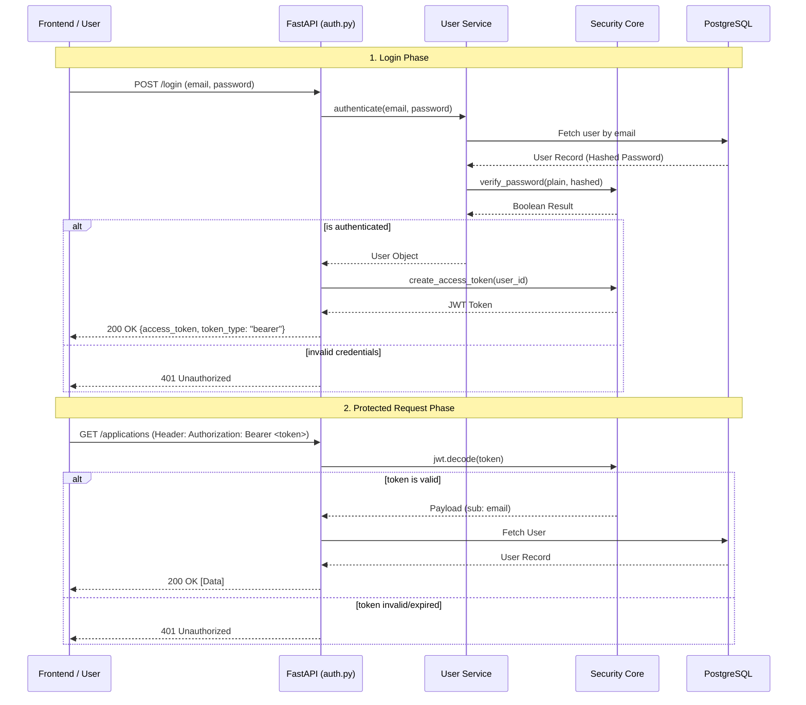
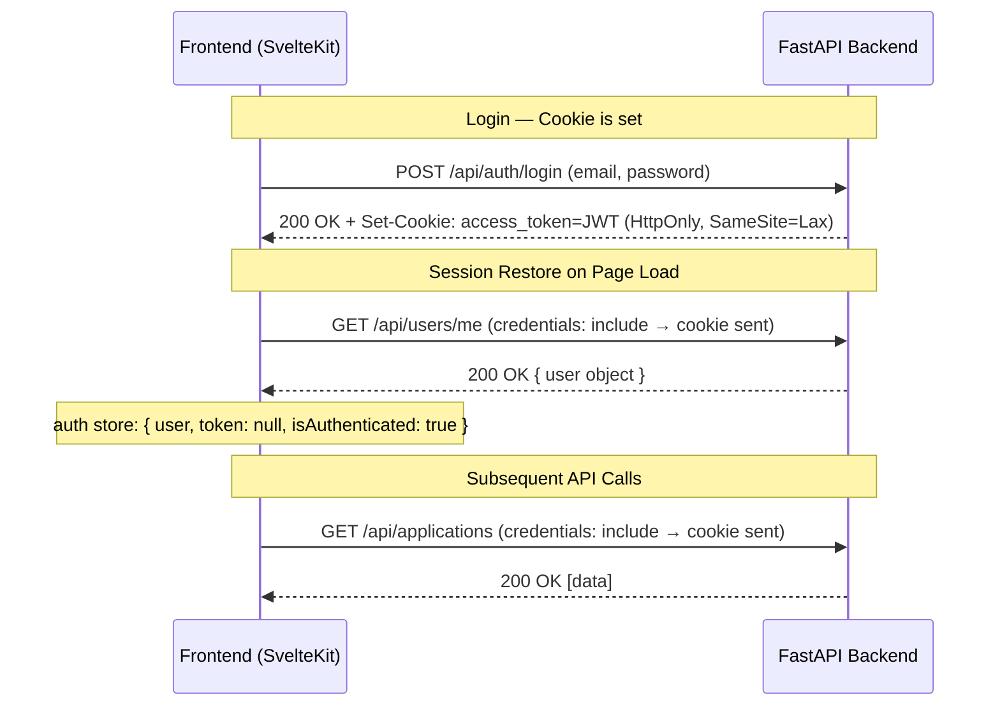

# Authentication & Security Flow

This document describes the security architecture for the Job Wizard backend. GitHub natively renders the Mermaid diagram below.

## Overview
The system uses a standard **OAuth2 with Password Flow** using **JWT (JSON Web Tokens)** for session management and **Bcrypt** for password hashing.

## Authentication Flow



## Security Implementation Details
1.  **Password Storage**: Never stored in plain text. We use `passlib` with the `bcrypt` algorithm.
2.  **Token Signing**: Tokens are signed using `HS256` with a `SECRET_KEY` defined in environment variables.
3.  **Token Expiration**: Access tokens are valid for 7 days by default.
4.  **Statelessness**: The backend does not store sessions in a database or Redis. All necessary user info is encoded in the JWT "subject" (email).
5.  **Data Authorization**: Every protected route performs a multi-layer ownership check. Even with a valid JWT, the database query explicitly filters results by the authenticated `user_id`.
6.  **Resource Isolation**: Guessable IDs (like `/applications/95`) are safe because the backend returns a `404 Not Found` if the requested resource does not belong to the currently logged-in user.

## Dual Auth: Bearer Token + HttpOnly Cookie

The system supports **two parallel authentication methods**. The backend (`deps.py → get_current_user`) checks both in order:

1. **Authorization Header** — `Authorization: Bearer <token>` (for API clients, Swagger, etc.)
2. **HttpOnly Cookie** — `access_token` cookie (for web browser sessions)

### How It Works



### Key Detail: `token` is `null` in Cookie-Based Sessions

When a user logs in via the browser, the JWT lives **only inside the HttpOnly cookie** — the frontend never stores it in memory or localStorage. The auth store state after initialization looks like:

```javascript
{ user: { ... }, token: null, isAuthenticated: true }
```

> **⚠️ CRITICAL**: Frontend code must **never** check `$auth.token` to determine if a user is logged in. Always use `$auth.isAuthenticated`.

### Frontend Auth Guard Pattern

Protected pages (e.g., `/applications`, `/applications/[id]`) use a **reactive subscription** to the auth store instead of a simple `onMount` check. This is necessary because:

- The root layout (`+layout.svelte`) calls `auth.initialize()` asynchronously in its own `onMount`
- Child page `onMount` hooks run concurrently — they do **not** wait for the layout's `auth.initialize()` to resolve
- A synchronous check like `if (!$auth.isAuthenticated) goto('/login')` would always redirect before the cookie-based session is restored

The correct pattern:

```javascript
let authChecked = false;

onMount(() => {
    // Subscribe reactively — fires when auth.initialize() resolves
    const unsubscribe = auth.subscribe(async (state) => {
        if (authChecked) return;

        if (state.isAuthenticated) {
            authChecked = true;
            await loadPageData();
        }
    });

    // Fallback: redirect to login if auth never resolves (no valid session)
    const timeout = setTimeout(() => {
        if (!authChecked) {
            authChecked = true;
            goto("/login");
        }
    }, 3000);

    return () => {
        unsubscribe();
        clearTimeout(timeout);
    };
});
```

This pattern ensures the page waits for the async cookie verification to complete before deciding whether to load data or redirect.

## Data Authorization Flow

When a user requests a specific resource (e.g., a Job Application), the system follows this logic:

1.  **Extract Identity**: The JWT token is decoded to find the `current_user`.
2.  **Strict Filtering**: The SQL query includes a mandatory ownership clause:
    ```sql
    SELECT * FROM application 
    WHERE id = :application_id 
    AND user_id = :current_user_id;
    ```
3.  **Privacy by Obscurity**: If the `user_id` does not match, the system responds with a `404 Not Found` rather than a `403 Forbidden` to avoid confirming the existence of the resource to unauthorized parties.

## PDF & Upload Security

The system handles files (PDFs, images) differently than structured database data to support sharing:

1.  **UUID-based Filenames**: All generated PDFs and uploaded assets are renamed to high-entropy UUIDs (e.g., `f9eeeac3-2a1a-49a6-9d1f-b726baa10b79.pdf`). This provides a massive search space (2^128) making it practically impossible for an attacker to "scrape" or guess another user's files.
2.  **Publicly Accessible Downloads**: To support the "Recruiter Flow" (where a recruiter needs to open a PDF or see a profile picture without having an account), the `/api/download` and `/api/uploads` endpoints are open.
3.  **Security by Obscurity**: Access to a file requires knowledge of its specific UUID. Since these links are only shared by the owner, this provides a balance between strict security and real-world usability.
4.  **Backend Robustness**: The download endpoints accept optional authentication. This ensures that even if a logged-in user's session expires, they can still download their generated documents without friction.
