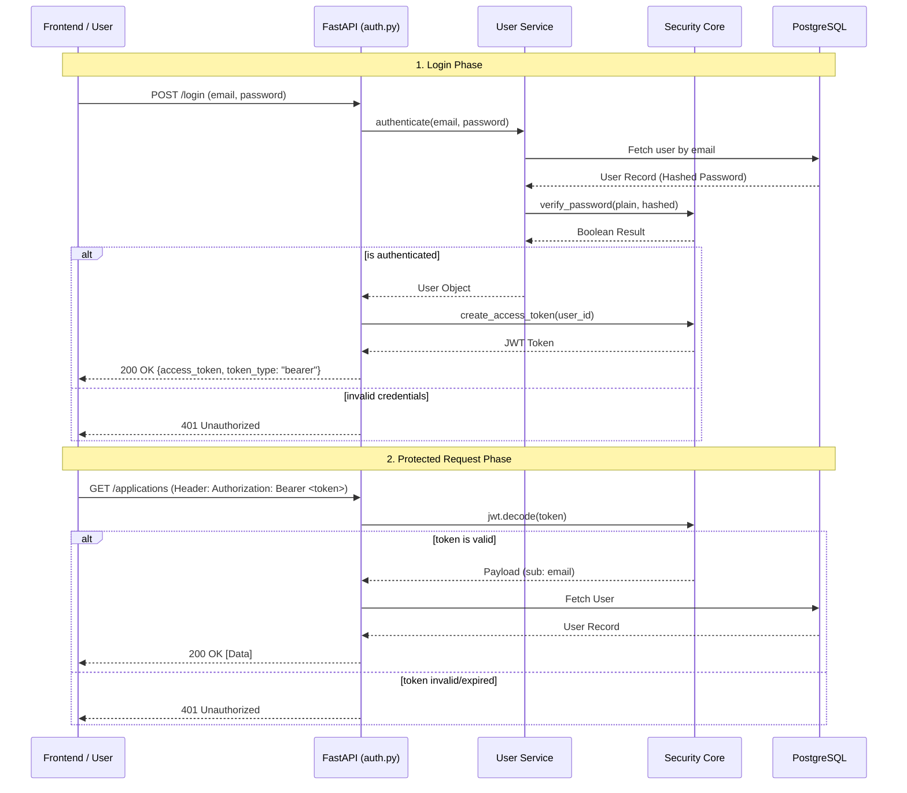

# Authentication & Security Flow

This document describes the security architecture for the Job Wizard backend. GitHub natively renders the Mermaid diagram below.

## Overview
The system uses a standard **OAuth2 with Password Flow** using **JWT (JSON Web Tokens)** for session management and **Bcrypt** for password hashing.

## Authentication Flow



## Security Implementation Details
1.  **Password Storage**: Never stored in plain text. We use `passlib` with the `bcrypt` algorithm.
2.  **Token Signing**: Tokens are signed using `HS256` with a `SECRET_KEY` defined in environment variables.
3.  **Token Expiration**: Access tokens are valid for 7 days by default.
4.  **Statelessness**: The backend does not store sessions in a database or Redis. All necessary user info is encoded in the JWT "subject" (email).
5.  **Data Authorization**: Every protected route performs a multi-layer ownership check. Even with a valid JWT, the database query explicitly filters results by the authenticated `user_id`.
6.  **Resource Isolation**: Guessable IDs (like `/applications/95`) are safe because the backend returns a `404 Not Found` if the requested resource does not belong to the currently logged-in user.

## Data Authorization Flow

When a user requests a specific resource (e.g., a Job Application), the system follows this logic:

1.  **Extract Identity**: The JWT token is decoded to find the `current_user`.
2.  **Strict Filtering**: The SQL query includes a mandatory ownership clause:
    ```sql
    SELECT * FROM application 
    WHERE id = :application_id 
    AND user_id = :current_user_id;
    ```
3.  **Privacy by Obscurity**: If the `user_id` does not match, the system responds with a `404 Not Found` rather than a `403 Forbidden` to avoid confirming the existence of the resource to unauthorized parties.
