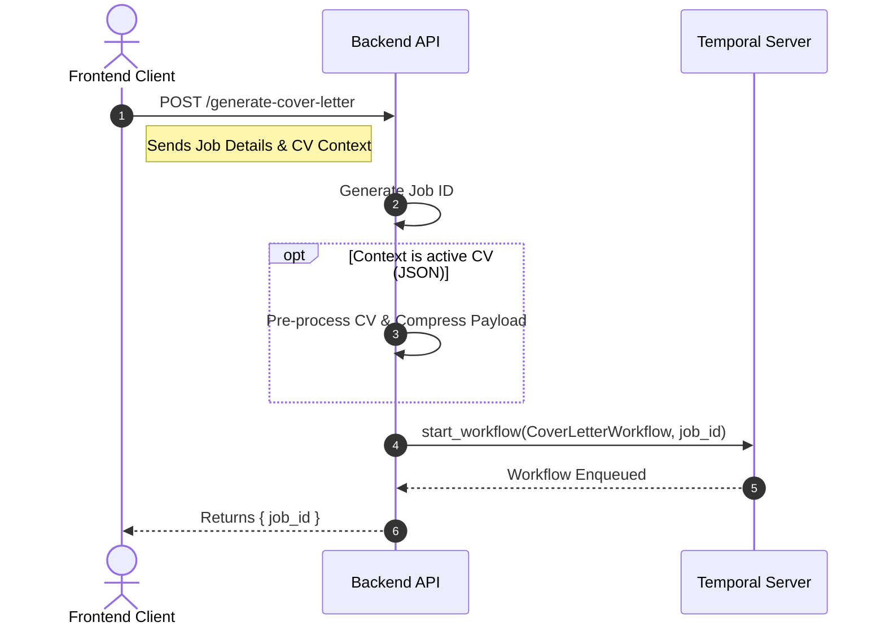
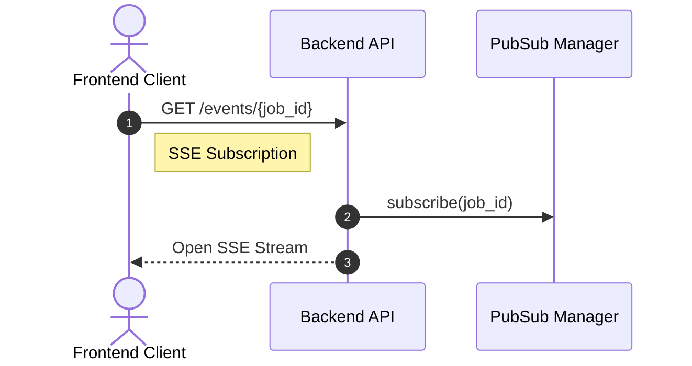
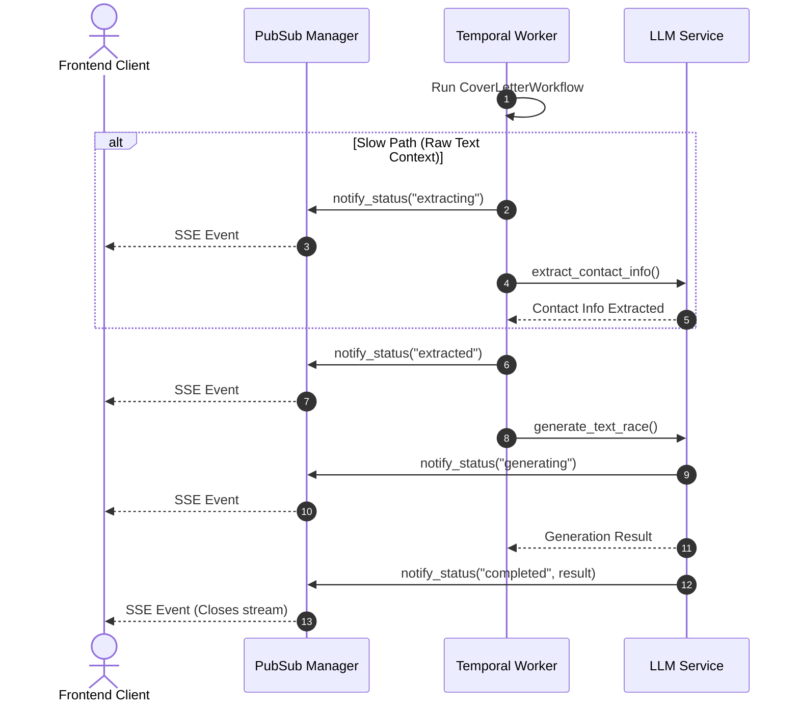
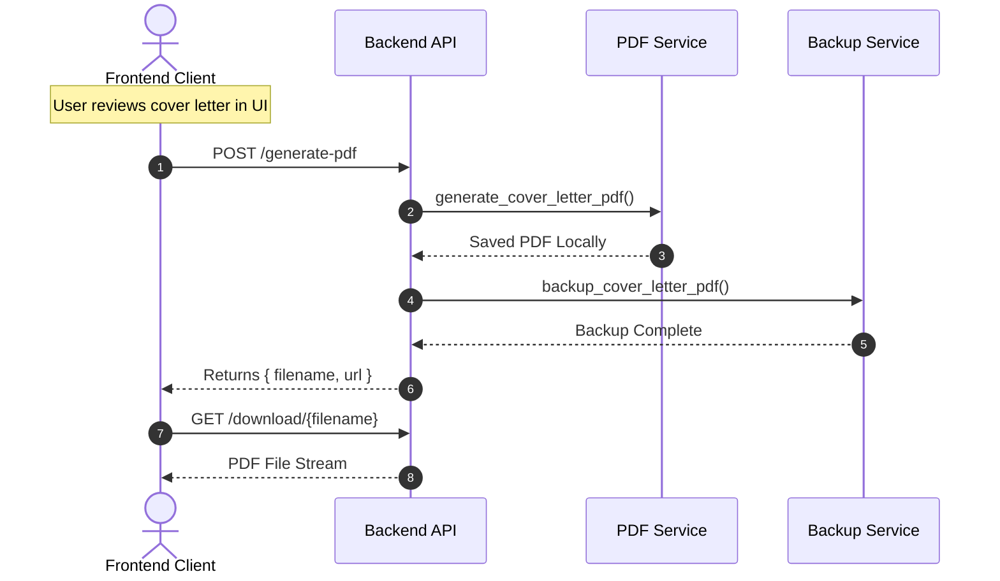

# Temporal.io Workflow Documentation

This document describes the implementation of **Temporal.io** in the Job Wizard project. Temporal is used to manage long-running, complex, and failure-prone operations—specifically the cover letter generation process.

## 1. Overview

Temporal.io provides a robust platform for orchestrating **Workflows** and **Activities**. By moving from standard asynchronous background tasks to Temporal, we achieve:
- **Fault Tolerance**: Automatic retries on failures (e.g., LLM timeouts).
- **Persistence**: Workflows resume exactly where they left off if a service restarts.
- **Observability**: A visual dashboard to track every step of the generation process.

## 2. System Architecture

The implementation is split into three main components:

### A. The Workflow (`workflows.py`)
The **Cover Letter Workflow** orchestrates the sequence of high-level steps. It is deterministic and handles the logic of "what happens next."
- **Job ID as Workflow ID**: We use the project's internal `job_id` as the Temporal `workflow_id` for 1:1 mapping.
- **Error Handling**: Defers retries for specific activities to the Temporal engine.

### B. Activities (`activities.py`)
Activities are the "heavy lifters" that interact with external services:
- `analyze_context_activity`: Extracts data from uploaded CVs/PDFs.
- `generate_text_race_activity`: Orchestrates the LLM "Race Mode" (Local vs. Remote).
- `render_pdf_activity`: Uses the ReportLab engine to generate the document.
- `notify_status_activity`: Bridges Temporal events back to the shared **SSE/PubSub** stream.

### C. The Worker (`worker.py`)
A dedicated service runs the Temporal Worker, which listens on the `cover-letter-tasks` queue and executes the code for both workflows and activities.

---

## 3. Data Flow Sequence Diagrams

The cover letter generation process spans across the frontend, API, Temporal, PubSub, and external services. The sequence is broken down into four phases below:

### Phase 1: Initiation


### Phase 2: Live Updates


### Phase 3: Extraction & Generation


### Phase 4: Finalization & PDF


---

## 4. Infrastructure & Persistence

### PostgreSQL Integration
Temporal is configured to use the existing **PostgreSQL** instance for its persistence layer.
- **Database Names**: `temporal` and `temporal_visibility`.
- **Initialization**: Handled by `services/database/init-temporal.sql` and the `temporalio/auto-setup` Docker image.

### Docker Services
- `temporal`: The core server/orchestrator.
- `temporal-ui`: Web interface for monitoring.
- `worker`: The Python worker running the application logic.

---

## 5. Developer Guide

### Running Locally
To start the Temporal stack along with the project:
```bash
docker compose up --build
```

### Accessing the Web UI
Monitor and debug workflows at:
**[http://localhost:8080](http://localhost:8080)**
- Use the **`jobwizard`** namespace to see active and completed generations.
- Click into a workflow to see its **Execution Graph**, **Input/Output**, and **Timeline**.

### Adding New Activities
1. Define the activity function in `app/services/cover_letter/activities.py`.
2. Decorate it with `@activity.defn`.
3. Register it in `app/worker.py`.
4. Call it from your workflow using `workflow.execute_activity()`.

## 6. Persistence & Retention
- **Namespace**: `jobwizard`
- **Retention Period**: Workflow history is stored for **7 days**. Completed workflows can be searched and inspected during this period before being pruned from the database.

---

## 7. Troubleshooting "Slowness"
The **Timeline View** in the Temporal UI is your best friend. If a cover letter is taking too long:
1. Open the workflow in the UI.
2. Click the **Timeline** tab.
3. Identify which activity is taking the most time (usually `generate_text_race_activity`).
4. Check if there were any retries (indicated by multiple attempt numbers) which suggest upstream model failures.
